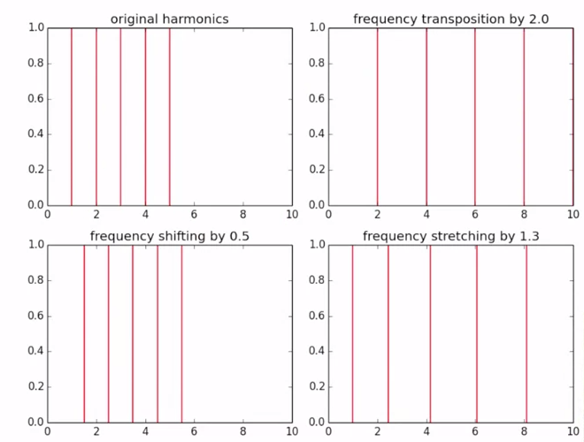

8A Peer-Assessment: Transformations
========= 

## Brief description of the transformation parameters

* freqScaling: frequency scaling factors to be applied to the harmonics of the sound, in time-value pairs (value of 1 is no scaling). The time values can be normalized, from 0 to 1, or can correspond to the times in seconds of the input sound. The scaling factor is a multiplicative factor, thus 1 is no change. Example: to transpose an octave the sound you can specify [0, 2, 1, 2].
* freqStretching: frequency stretching factors to be applied to the harmonics of the sound, in time-value pairs (value of 1 is no stretching). The time values can be normalized, from 0 to 1, or can correspond to the times in seconds of the input sound. The stretching factor is a multiplicative factor whose effect depend on the harmonic number, higher harmonics being more effected that lower ones, thus resulting in an inharmonic effect. A value of 1 results in no effect. Example: an array like [0, 1.2, 1, 1.2] will result in a perceptually large inharmonic effect.
* timbrePreservation: 1 preserves the original timbre, 0 it does not. It can only have a value of 0 or of 1. By setting the value to 1 the spectral shape of the original sound is preserved even when the frequencies of the sound are modified. In the case of speech it would correspond to the idea of preserving the identity of the speaker.
* timeScaling: time scaling factors to be applied to the whole sound, in time-value pairs (value of 1 is no scaling). The time values can be normalized, from 0 to 1, or can correspond to the times in seconds of the input sound. The time scaling factor is a multiplicative factor, thus 1 is no change. Example: to stretch the original sound to twice the original duration, we can specify [0, 0, 1, 2].

All the transformation values can have as many points as desired, but they have to be in the form of an array with time-value pairs, so of even size.   
For example a good array for a frequency stretching of a sound that has a duration of 3.146 seconds could be: [0, 1.2, 2.01, 1.2, 2.679, 0.7, 3.146, 0.7].

## Question 1. Obtain a good harmonic+stochastic analysis of a speech sound

* transformation  
The sound changes from the male voice to female's.  
frequency scaling:lower on the male part and gradually changes to female.  
time scaling: stretch on the male part and gradually changes to female.  

* parameters
 * window type:blackman
 * window size:2001
 * FFT size:4096
 * threshold:-80
 * minSineDur:0.1
 * number of harmonics:33
 * minimum f0:146
 * maximum f0:222
 * error threshold in f0 detection:5
 * deviation of harmonic :0.01
 * stochastic decimation factor:0.1
 * frequency scaling:[0,0.5,0.48,0.6,0.5,0.9,0.52,1,1,1.4]
 * frequency stretching:[0,1,0.5,1,1,1.01]
 * timbre preservation:0
 * time scaling:[0,0,0.48,0.4,0.5,0.5,0.52,0.6,0.9,0.8,1,1]

* sound file
[attach]()

## Question 2. Perform creative transformations with a sound of your choice

[the original sound](https://www.freesound.org/people/padron/sounds/254806/)

* transformation  
Inversed the original sound and add stretch effect.  
frequency scaling:inverse the musical scale.  
frequency stretch:add stretching effect.  
time scaling: inverse the rhythm.  

* parameters
 * window type:blackman
 * window size:2001
 * FFT size:4096
 * threshold:-100
 * minSineDur:0.1
 * number of harmonics:20
 * minimum f0:250
 * maximum f0:500
 * error threshold in f0 detection:7
 * deviation of harmonic :0.001
 * stochastic decimation factor:0.1
 * frequency scaling:[0,0.5,0.8,2,0.9,1,1.4,2]
 * frequency stretching:[0,0.5,0.8,0.8]
 * timbre preservation:1
 * time scaling:[0,0,0.8,1.6,0.9,1.7,1.4,2]
 